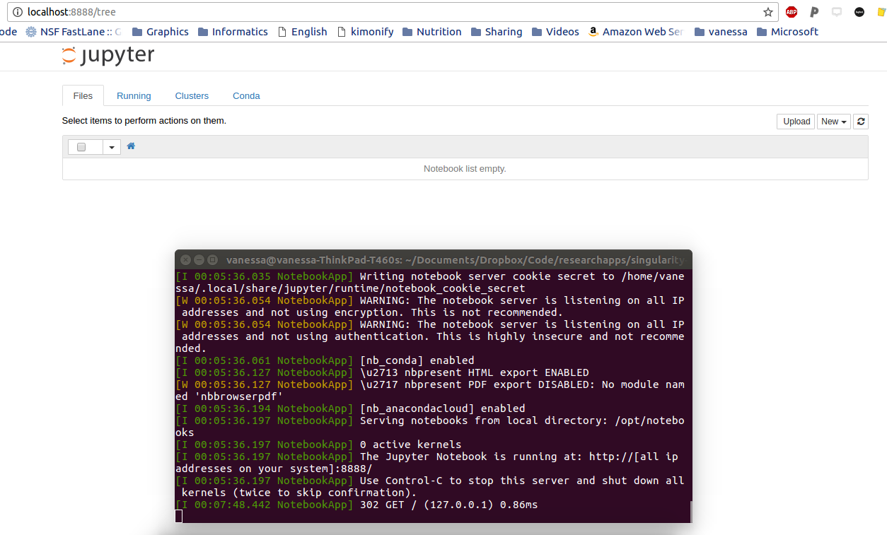
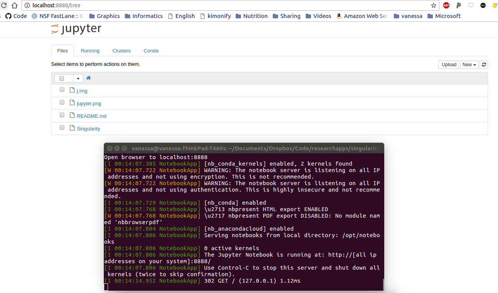

# Nginx-jupyter

This example will show how to run a jupyter notebook server, from a container, either using files inside the container...

- perhaps you ran an analysis when you created the container, and want to serve the notebook as a result) or
- perhaps you want this to be like a working container, to store a particular version of your software to use on local files

If you haven't installed singularity, do that with [these instructions](http://singularity.lbl.gov/install-linux). Then Download the repo if you haven't already:

      git clone https://www.github.com/singularityhub/jupyter
      cd jupyter

Let's now create a jupyter notebook!

      sudo singularity create --size 4000 jupyter.img
      sudo singularity bootstrap jupyter.img Singularity

Then to run our container, since we need to write files to `/opt/notebooks` inside the container, we must use sudo and add the `--writable` command:

      sudo singularity run --writable jupyter.img

When we open the browser, we see our server! Cool!

Since the notebooks are being written to the image, this means that all of our work is preserved in it. I can finish working, close up shop, and hand my image to someone else, and it's preserved. Here, I'll show you. Let's shell into the container after we've shut down the server (note that I didn't need to use sudo for this).

      sudo singularity shell jupyter.img 
      Singularity: Invoking an interactive shell within container...

      Singularity.jupyter.img> ls /opt/notebooks
      Untitled.ipynb

There it is! I really should work on naming my files better :) That is so cool.

You can also map to a folder on your local machine, if you don't want to save the notebooks inside:

      sudo singularity run -B $PWD:/opt/notebooks --writable jupyter.img

and here I am sitting in my local directory, but the entire software and depdencies are provided by my container. STILL really cool.

